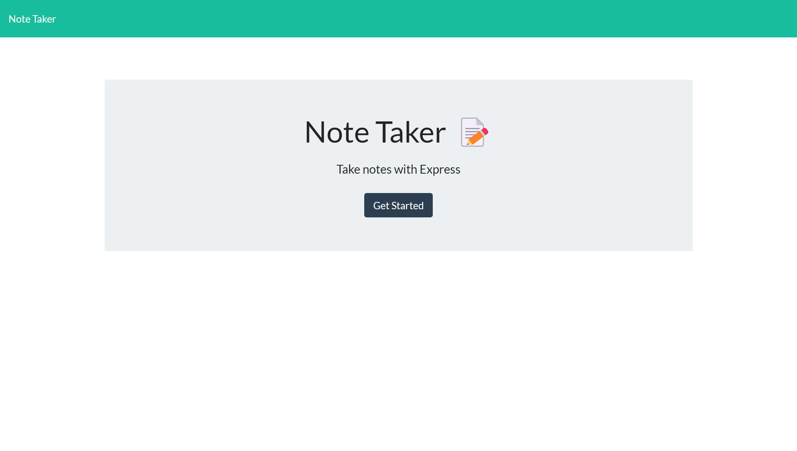
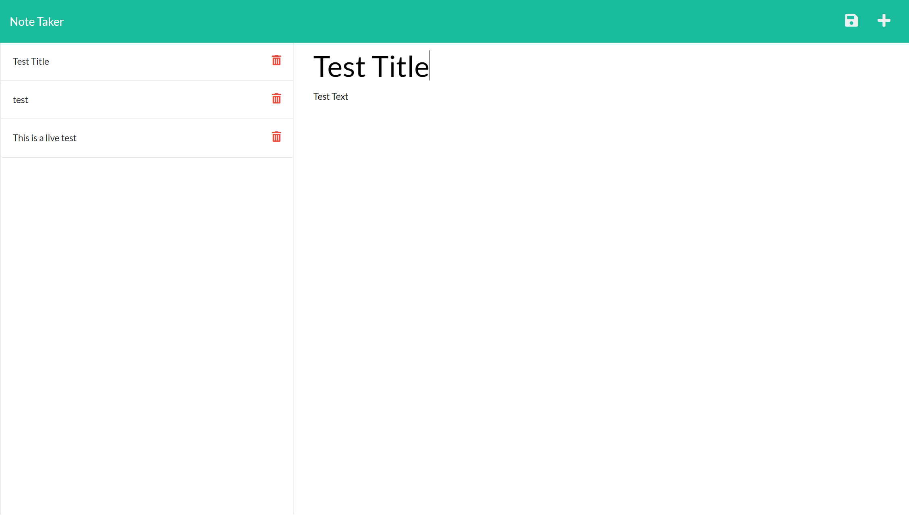

# Express Note Taker

## Description
A server that will store notes inputted by a user.

## Tablet of Contents
- [Installation](#installation)
- [Usage](#usage)
- [License](#license)
- [How to Contribute](#how-to-contribute)
- [Tests](#tests)
- [Questions](#questions)
- [Deployed Link](#deployed-link)

## Installation
Simply an npm i

## Usage
Click 'Get Started' then type out a title and description. Lastly, click the save button in the upper right corner to store the note.

## License
ISC

## How to Contribute
Ask me for access

## Tests
NA

## Questions
* Follow me on [GitHub](https://github.com/favalos06)
* Ask me question at fernando.avalostorres91@gmail.com

## Deployed Link
https://express-note-taker-fa.herokuapp.com/
  